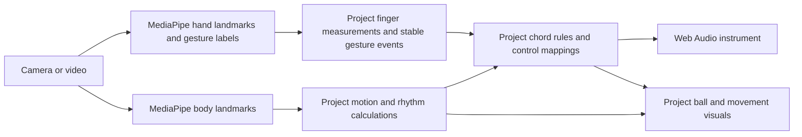

# How dance2music works

Last reviewed: 2026-10-05. This describes the code currently in this repository and separates
existing behavior from Anthony's planned features.

MediaPipe supplies estimates of where the body and hands are, plus a small set of hand-gesture
labels. The project code turns those estimates into an instrument: it cleans and measures motion,
stabilizes gestures, selects chords, maps controls to sound, draws the ball, and manages playback.
The model does not compose the music or decide the meaning of a gesture in this instrument.

Here, **project code** means the application logic already in dance2music, including Joseph's work,
and the new behavior we plan to add. It does not mean every underlying algorithm or library was
invented by this project.

## 1. The three existing ways to run the project

### Recorded-video processing in Python

The Python pipeline analyzes a video and produces saved measurements, sound, MIDI, and comparisons.

| File | Responsibility |
| --- | --- |
| [dance_pose.py](dance_pose.py) | Read frames, run MediaPipe pose, save landmarks, derive rule-based movement signals, and support rope-engine rendering/overlays |
| [motion.py](motion.py) | Clean position measurements and calculate motion features and sudden events |
| [harmony.py](harmony.py) | Apply pose/region chord rules, timing requirements, and voice leading |
| [synths.py](synths.py) | Render sound layers, stems, visual overlays, and the comparison page's generated material |
| [vocabulary.py](vocabulary.py) | Discover groups of similar dance shapes from recorded pose windows |
| [sonify.py](sonify.py) | Map those discovered shapes to musical choices and export MIDI with control lanes using the external rope engine |

The `motion.py`/`synths.py` route and the vocabulary/rope-engine route are related experiments,
not one mandatory sequence in which every file must always run.

### Live camera/video interaction in JavaScript

The existing live instrument runs in the browser under `web/live/`. The camera or video supplies
frames; MediaPipe runs in the browser; the project evaluates controls and creates sound with Web Audio.

[live.py](live.py) serves these files on localhost. Starting `python live.py` does not move the
browser's gesture, harmony, or ball logic into Python.

### Native live interaction in Python

The separate [instrument/](instrument/) prototype implements Anthony's ideas 0–2 locally.
Run `.venv/Scripts/python.exe -m instrument --demo` for a scripted example or
`--camera 0` for camera input. MediaPipe Tasks provide mirrored hand positions,
gesture labels and torso geometry; the Python application supplies all musical behavior.

| Module | Responsibility |
| --- | --- |
| [models.py](instrument/models.py) | Validated timestamped observations, configuration and immutable outputs |
| [controller.py](instrument/controller.py) | Closure/rearm, split priority, persistent root lock and renderer-independent ball geometry |
| [harmony.py](instrument/harmony.py) | Twelve root sectors, six absolute quality selections and bounded voice leading |
| [visuals.py](instrument/visuals.py) | Joseph-inspired fire/light glow, sparks, root guides and visible lock/split feedback |
| [audio.py](instrument/audio.py) | Device-free synthesis with pitch/gain smoothing and optional sounddevice playback |
| [tracking.py](instrument/tracking.py) | Explicit local model loading and rejection of unreliable or invalid observations |
| [replay.py](instrument/replay.py) | Deterministic demo and validated JSONL inputs without devices |
| [__main__.py](instrument/__main__.py) | Camera/video/demo/replay commands, native window, diagnostics and resource cleanup |

Runtime never downloads models. The explicit setup helper stores them in ignored
`output/models`. The controller can be tested without model files, camera or audio.
WAV exports apply each observation from its timestamp onward, including irregular
frame gaps. The AVI preview uses a fixed frame rate and can differ from source timing.
See [quickstart](specs/001-anthony-instrument/quickstart.md),
[decisions](specs/001-anthony-instrument/decisions.md) and
[validation evidence](specs/001-anthony-instrument/evidence.md).

## 2. What the computer-vision models provide

### Body pose

The pose model estimates 33 body landmarks, including shoulders, elbows, wrists, hips, knees,
and ankles. The Python tracker saves image coordinates and visibility values, and also saves
the model's estimated world-coordinate landmarks when available.

The model and its runtime handle locating/tracking the body. The Python tracker also enables
MediaPipe's own landmark smoothing. Our additional motion processing is a separate layer.

The existing browser loop passes only image `x`, `y`, and visibility into the live feature code.
It does not use estimated depth for the current ball. Likewise, `motion.py` calculates its main
motion features from 2D image positions. Other offline paths use the saved world landmarks.

The coordinates are estimates from the images, not measurements from a physical depth sensor.
Occlusion, framing, and uncertainty still affect the application.

Sources: [dance_pose.py](dance_pose.py), [web/live/live.js](web/live/live.js),
[motion.py](motion.py), and [vocabulary.py](vocabulary.py).

### Hands and built-in gestures

The live hand system uses MediaPipe Gesture Recognizer. It supplies 21 landmarks per detected
hand and a gesture label with a score. The current app exposes seven built-in labels:

- Closed fist.
- Open palm.
- Pointing up.
- Thumb up.
- Thumb down.
- Victory.
- "I love you" hand sign.

**Recognizing a closed fist is already supplied by the model.** Making that fist lock a musical
root, toggle it once, or split a ball is application behavior that we implement around the label.

The current finger count and continuous hand-openness values are calculated by project code from
landmark distances. They are not direct outputs of a model that understands our musical controls.

Source: [web/live/hands.js](web/live/hands.js).

## 3. What the project adds after computer vision

### Getting usable measurements

Raw or already model-smoothed coordinates can still flicker, disappear, or jump. Taking their
derivatives can amplify small errors into large apparent movements. The project handles this by:

- Rejecting low-visibility points and suspicious jumps.
- Handling short gaps and reducing trust in missing observations.
- Applying additional smoothing.
- Measuring positions and motion relative to torso size so camera distance has less influence.
- Estimating the residual motion seen while nearly still, then reducing that noise floor.

Offline `motion.py` uses robust glitch removal, a Butterworth filter, and Savitzky-Golay derivatives.
The live feature code uses One-Euro filtering and polynomial fits over trailing samples.

This distinction matters: offline processing can use later video frames to improve an earlier
measurement. A live instrument must respond using information available so far. Translating an
offline algorithm into live code therefore requires a timing and behavior review.

Sources: [motion.py](motion.py) and [web/live/features.js](web/live/features.js).

### Calculating movement and rhythm

The project calculates speed, acceleration, jerk, body travel, hand position, and size/shape
measurements. It also derives numerical proxies for the Laban Efforts:

| Feature | What the code measures |
| --- | --- |
| Weight | A motion-intensity proxy based on limb speed/energy |
| Time | Suddenness based on acceleration |
| Space | How directly the hands travel versus the length of their paths |
| Flow | Jerk relative to acceleration, used as a movement-quality proxy |

These are designed measurements, not MediaPipe labels for artistic intention, emotion, or
physical force. Their names describe the interpretation chosen for the instrument.

The live code also estimates rhythmic regularity and detects sudden movement events.
[bounce.js](web/live/bounce.js) tracks hip bouncing with a Bayesian filter over tempo and phase.
MediaPipe supplies hip positions; the project's filter decides whether those positions indicate
a usable bounce pulse and estimates its timing.

Sources: [motion.py](motion.py), [web/live/features.js](web/live/features.js),
and [web/live/bounce.js](web/live/bounce.js).

### Making hand recognition usable as a control

Our hand code does more than call the recognizer. It can crop around the pose-estimated wrists
when the hands are small in a full-body view, transform crop coordinates back into video coordinates,
associate detections with the body's hands, calculate finger extension/openness, and require a
candidate gesture or finger count to stay stable before accepting it.

For example, the current settings require a gesture candidate to last about 0.35 seconds and
a finger-count candidate about 0.3 seconds. Those are application settings, not musical decisions
made by the CV model.

The current gesture-action code makes a fist hold the chord while shown. It does not implement
Anthony's persistent root-lock toggle yet. Detecting a label, stabilizing it, recognizing a new
closure event, and updating musical state are separate responsibilities.

Sources: [web/live/hands.js](web/live/hands.js) and [web/live/live.js](web/live/live.js).

### Choosing harmony

The harmony code decides which pose/hand region or finger count selects which chord. It maintains
the current selection, waits for a candidate to last long enough, and chooses voicings that reduce
movement between successive notes. It also provides the fixed chord palettes used by the current modes.

MediaPipe does not output "G minor," decide that a quadrant means a dominant chord, or know whether
the performer wants the previous root held. Those meanings come from musical rules and state in
the application.

Sources: [harmony.py](harmony.py) and [web/live/harmony.js](web/live/harmony.js).

### Mapping controls and producing sound

The live mapping system connects measured sources to destinations such as pad loudness, brightness,
bass character, or instrument volume. Project settings specify ranges, curves, gains, inversion,
and how quickly sound parameters rise or fall.

The audio code builds voices, filters, FM sounds, plucks, percussion, reverb, and output controls.
Web Audio provides the browser's audio primitives; the project defines the instrument built from
them. The Python renderer similarly uses established numerical/DSP tools and project synthesis code.

Some offline workflows also reuse the external rope project's performance engine, MIDI writer,
and voice-leading tools. That is another dependency, separate from MediaPipe.

Sources: [web/live/mapping.js](web/live/mapping.js), [web/live/audio.js](web/live/audio.js),
[synths.py](synths.py), [dance_pose.py](dance_pose.py), and [sonify.py](sonify.py).

### Drawing the ball and recording the result

Joseph's current ball is drawn by project JavaScript with Canvas 2D. Its center is the wrists'
midpoint; its radius is half their image-plane distance. Project code draws the glow, chord/fire
colors, flicker, and sparks. The `Sphere` sound preset applies a cubic curve to normalized radius
to control loudness; `Sphere, gentle` uses a softer exponent of 1.5.

**The CV model never detects or generates this virtual ball.** It provides wrist estimates from
the camera, and our geometry/rendering/mapping code creates the ball and its musical response.

Recording combines the camera image, overlays, and the instrument's audio through browser recording
facilities. This is application/platform work, not a vision-model capability.

Sources: [web/live/live.js](web/live/live.js), [web/live/features.js](web/live/features.js),
[web/live/mapping.js](web/live/mapping.js), and [web/live/recorder.js](web/live/recorder.js).

## 4. Are we training our own AI?

The pose and hand-recognition paths described above load existing MediaPipe models. They do not
train a new neural pose model, a new fist recognizer, or a model that learns which chords we want.

There is a separate data-driven experiment in [vocabulary.py](vocabulary.py). It builds feature
windows from recorded dance, standardizes them, uses PCA, clusters them with k-means, and uses UMAP
for a visual embedding. These standard algorithms discover groups of similar shapes; the project
chooses the features and settings, interprets the groups, and assigns musical meanings.

That experiment fits analysis to the dance data. It does not retrain MediaPipe, and it is not the
existing live spell-recognition system. The live chord rules and built-in hand gestures are distinct.

## 5. How much comes from the model, and how much are we doing?

The useful split is by responsibility:

| Responsibility | MediaPipe/model contribution | Project/application contribution |
| --- | --- | --- |
| Locate body and hand joints | Learned detection/tracking and landmark estimates | Capture, model setup, cropping, coordinate handling, and confidence policies |
| Recognize a built-in fist | Gesture label and score | Stability checks, event handling, and the meaning of that event |
| Count fingers and measure openness | Hand landmarks | Distance tests, smoothing, counting, and mappings |
| Measure movement quality | Body landmarks | Cleaning, derivatives, normalization, and feature formulas |
| Detect a useful musical pulse | Hip positions | Rhythm analysis, bounce filter, gating, and scheduling |
| Choose chords | No musical decision | Region/finger rules, palettes, dwell, voicing, and musical state |
| Produce sound or MIDI | No music generation | Instrument design, synthesis/control mappings, and output integration |
| Draw and manipulate a ball | Wrist positions used as input | Ball geometry, animation, interaction state, and rendering |
| Provide the app | No UI/recording workflow | Camera controls, mixer, feedback, recording, and local serving |

There is no measured percentage of total effort, code ownership, or frame-processing time available
from this review. A small call into a pretrained model represents substantial upstream model work;
counting that call as a few lines would be misleading. Timing shares require profiling, and effort
shares require a different measurement.

The pretrained perception layer is a major dependency. Most of the instrument's behavior and all
its musical interpretations are supplied by application logic around that dependency. That logic
also relies on third-party libraries and established algorithms; it is not all built from scratch.

## 6. What our next work actually is

The following separates implemented Python behavior from future directions recorded in
[ANTHONY_IDEAS.md](ANTHONY_IDEAS.md). None of this musical behavior comes automatically from MediaPipe:

| Area | Current Python behavior or remaining work |
| --- | --- |
| Persistent fist root lock | Implemented: deliberate closure toggles root-only lock; reopening rearms; quality remains editable |
| Musician-oriented harmony | Implemented: all 12 roots and six qualities, 72 reachable chords; broader catalogues remain future work |
| Two-ball split | Implemented: nearby stable fists suppress lock, split persists, M merges; a merge gesture remains future work |
| Three-move spells | Ordered-sequence recognition, progress, timing, cancellation, and musical actions |
| Beginner game | Challenges, interaction rules, fair feedback, and lessons tied to the instrument's vocabulary |
| Expressive Chords output | A live Python MIDI adapter sending one configured trigger note per chord, with verified note lifecycle and cleanup |
| Temporary ball visual | Implemented: Python fire/light glow and bounded sparks using Joseph's 2D wrist geometry |
| Later 3D/animated asset | Renderer/asset integration and depth/rotation/hold-time behavior, deferred until that work is requested |

For example, the Python lock action has four separate steps: the model recognizes a fist; our event
logic accepts a deliberate closure; our musical state locks the root; our renderer shows feedback.
The existing model covers the first step. The Python instrument implements the other steps.

New features are developed, run, and validated locally in Python first. Translating them into the
JavaScript website requires Anthony's explicit request. The temporary 2D ball decision defers 3D
work while allowing the gesture, harmony, and MIDI behavior to be developed.

## 7. Where to look for detail

- [README.md](README.md): existing commands and project background.
- [web/methods.html](web/methods.html): detailed formulas and documented experiments.
- [ANTHONY_IDEAS.md](ANTHONY_IDEAS.md): vision, accepted decisions, priorities, and design flaws.
- [.specify/memory/constitution.md](.specify/memory/constitution.md): development rules.
- [status.md](status.md): task outcomes and remaining work.
